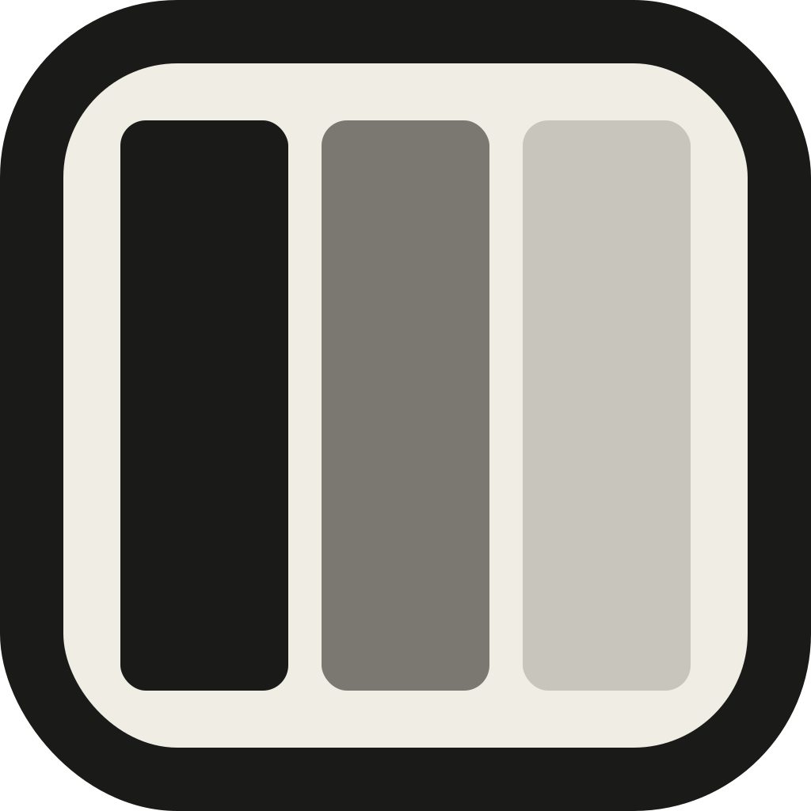

<p align="center">
  
</p>

<h1 align="center">Jalousie</h1>

<p align="center">
  A lightweight native macOS tiling window manager built as a proper <code>.app</code> bundle in Swift. Automatically tiles windows into equal horizontal splits with keyboard-driven focus, swap, zoom, and space movement — no scripting additions, no SIP modifications, no third-party dependencies. Works on macOS Tahoe (26.x) with SIP enabled.
</p>

---

## Features

- **Auto-tile** every user window into equal horizontal splits on each display, per-monitor.
- **Adaptive widths** for apps with hard-coded minimums (Xcode, Discord, Slack) — they get their floor, everyone else equal-shares the remainder instead of overlapping.
- **Focus left/right** across the tiled slot order.
- **Swap left/right** — trade the focused window with its neighbor.
- **Zoom-fullscreen** toggle — any window can be expanded to its display's full frame while keeping its slot in memory; focus/swap still traverses the underlying order. Multiple windows can be zoomed at once.
- **Send window to space N** — works on macOS 26 via the private bridged-operation path (no scripting addition, no SIP off).
- **Multi-monitor** — drag windows between displays and each screen re-tiles independently.
- **Drag-to-move**, then release — the mouse-up flushes a single retile that snaps the window back to its slot.
- **Config hot-reload** — edit `~/.config/jalousie/config.json`, hit "Reload config", changes take effect immediately.
- **App blacklist** — apps you never want tiled.
- **No timers, no polling, no animations** — every reaction is AXObserver- or NSEvent-driven.

## Default hotkeys

| Combo | Action |
|---|---|
| `Option + J` / `L` | Focus left / right |
| `Option + Shift + J` / `L` | Swap focused window left / right |
| `Option + Shift + M` | Toggle zoom-fullscreen on focused window |
| `Option + Shift + E` | Manual retile |
| `Option + Shift + 1..5` | Send focused window to space 1..5 |

All bindings are re-mappable in `~/.config/jalousie/config.json`.

## Build & install

```sh
xcodebuild -scheme Jalousie -configuration Release -derivedDataPath build
cp -r build/Build/Products/Release/Jalousie.app /Applications/
open /Applications/Jalousie.app
```

Grant Accessibility access when prompted, then click **Relaunch Jalousie** in the alert — macOS caches the TCC decision at process launch, so a fresh instance is required to pick up the grant.

## Constraints on macOS 26 (Tahoe)

Apple gated several private WindowServer APIs on Tahoe behind an entitlement no third-party app can obtain. Jalousie works around this via:

- **Firefox / Discord / Slack silently dropping AX writes** → we temporarily disable each app's `AXEnhancedUserInterface` attribute across a retile, restore after.
- **`SLSSpaceAddWindowsAndRemoveFromSpaces` returning `-1342177280` (unentitled)** → we walk the SkyLight image's local symbol table via a small Mach-O parser to reach the private perform function directly, bypassing the gate. Same technique yabai adopted in v7.1.25.
- **TCC not re-evaluating trust in-process** → the first-launch flow offers a "Relaunch Jalousie" button that spawns a fresh instance via `open -n`.

`CGSShowSpaces` / `CGSHideSpaces` (used for programmatic space switching without moving a window) is heavily clamped on Tahoe with no known SIP-enabled bypass. Send-to-space still works; switch-to-space dispatches but is a visual no-op in most configurations.

## Icons

- `assets/jalousie-icon.svg` — application icon, 1024×1024. Convert to `.icns` via Xcode's asset catalog when producing a release build.
- `assets/jalousie-menubar.svg` — menu-bar template glyph, 22×22. Currently the menu bar uses the `rectangle.split.3x1` SF Symbol as a placeholder; wiring the custom template requires generating 1x/2x PNGs and adding a `MenuBar.imageset` (with template-rendering intent) to `Assets.xcassets`.

## Spec

Detailed architecture, module responsibilities, private-API notes, and Tahoe constraints live in `jalousie-spec.md`.
