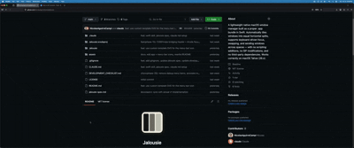
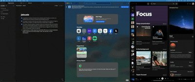
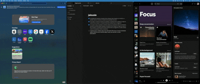
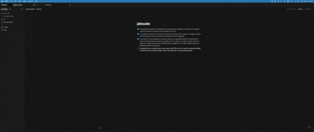

<p align="center">
  
</p>

<h1 align="center">Jalousie</h1>

<p align="center">
  A lightweight native macOS tiling window manager built as a proper <code>.app</code> bundle in Swift. Automatic horizontal tiling driven entirely from the keyboard — no scripting additions, no SIP modifications, no third-party dependencies. Works on macOS Tahoe (26.x) with SIP enabled.
</p>

---

## Core features

### Auto-tile on launch

Every user window snaps into an equal horizontal split the moment it opens. Apps with hard-coded minimum widths (Xcode, Discord, Slack) get their floor; the remainder is equal-shared across the other slots instead of overlapping the screen edge.



### Focus left / right

Traverse the tiled slot order from the keyboard. Focus follows the visual left-to-right order on the current display, not window z-order.


### Drag-to-move, snap-back retile

Drag any window with the mouse; on release, a single retile flushes and everything snaps back into slot order. Drag a window across displays and each screen re-tiles independently.



### Zoom-fullscreen toggle

Expand the focused window to fill its display while keeping its slot in memory. Focus and swap still traverse the underlying order beneath the zoomed window, and multiple windows can be zoomed at once.



### Send window to another space

Move the focused window to space 1–5 via the private bridged-operation path — works on macOS 26 without a scripting addition and without disabling SIP.



## Other features

- **Swap left / right** — trade the focused window with its neighbor.
- **Multi-monitor** — each display tiles independently.
- **Config hot-reload** — edit `~/.config/jalousie/config.json`, hit "Reload config", changes apply immediately.
- **App blacklist** — apps you never want tiled.
- **No timers, no polling, no animations** — every reaction is `AXObserver`- or `NSEvent`-driven.

## Default hotkeys

| Combo | Action |
|---|---|
| `Option + J` / `L` | Focus left / right |
| `Option + Shift + J` / `L` | Swap focused window left / right |
| `Option + Shift + M` | Toggle zoom-fullscreen on focused window |
| `Option + Shift + E` | Manual retile |
| `Option + Shift + 1..5` | Send focused window to space 1..5 |

## Custom hotkeys config

Every binding is re-mappable in `~/.config/jalousie/config.json`. Modifiers accept `"option"`, `"shift"`, `"command"`, `"control"`. Keys are single characters or digits.

```json
{
  "hotkeys": {
    "focus-left":             { "key": "j", "modifiers": ["option"] },
    "focus-right":            { "key": "l", "modifiers": ["option"] },
    "swap-left":              { "key": "j", "modifiers": ["option", "shift"] },
    "swap-right":             { "key": "l", "modifiers": ["option", "shift"] },
    "toggle-zoom-fullscreen": { "key": "m", "modifiers": ["option", "shift"] },
    "retile":                 { "key": "e", "modifiers": ["option", "shift"] },
    "send-to-space-1":        { "key": "1", "modifiers": ["option", "shift"] },
    "send-to-space-2":        { "key": "2", "modifiers": ["option", "shift"] },
    "send-to-space-3":        { "key": "3", "modifiers": ["option", "shift"] },
    "send-to-space-4":        { "key": "4", "modifiers": ["option", "shift"] },
    "send-to-space-5":        { "key": "5", "modifiers": ["option", "shift"] }
  },
  "blacklist": [
    "com.apple.finder",
    "com.apple.systempreferences",
    "com.apple.ActivityMonitor",
    "com.apple.Terminal",
    "com.apple.calculator"
  ],
  "settings": {
    "autoTile": true,
    "tileOnSpaceSwitch": true,
    "windowGap": 0,
    "ignoreSingleWindow": false
  }
}
```

Save, then click **Reload config** in the menu bar dropdown.

## Build & install

```sh
xcodebuild -scheme Jalousie -configuration Release -derivedDataPath build
cp -r build/Build/Products/Release/Jalousie.app /Applications/
open /Applications/Jalousie.app
```

Grant Accessibility access when prompted, then click **Relaunch Jalousie** in the alert — macOS caches the TCC decision at process launch, so a fresh instance is required to pick up the grant.

## Constraints on macOS 26 (Tahoe)

Apple gated several private WindowServer APIs on Tahoe behind an entitlement no third-party app can obtain. Jalousie works around this via:

- **Firefox / Discord / Slack silently dropping AX writes** → we temporarily disable each app's `AXEnhancedUserInterface` attribute across a retile, restore after.
- **`SLSSpaceAddWindowsAndRemoveFromSpaces` returning `-1342177280` (unentitled)** → we walk the SkyLight image's local symbol table via a small Mach-O parser to reach the private perform function directly, bypassing the gate. Same technique yabai adopted in v7.1.25.
- **TCC not re-evaluating trust in-process** → the first-launch flow offers a "Relaunch Jalousie" button that spawns a fresh instance via `open -n`.

`CGSShowSpaces` / `CGSHideSpaces` (used for programmatic space switching without moving a window) is heavily clamped on Tahoe with no known SIP-enabled bypass. Send-to-space still works; switch-to-space dispatches but is a visual no-op in most configurations.

## Icons

- `assets/jalousie-icon.svg` — application icon, 1024×1024. Convert to `.icns` via Xcode's asset catalog when producing a release build.
- `assets/jalousie-menubar.svg` — menu-bar template glyph, 22×22. Wired via `Jalousie/Assets.xcassets/MenuBarIcon.imageset` with template-rendering intent + vector preservation; loaded in `AppDelegate.setupStatusItem` with a fallback to the `rectangle.split.3x1` SF Symbol.

## Spec

Detailed architecture, module responsibilities, private-API notes, and Tahoe constraints live in `jalousie-spec.md`.
